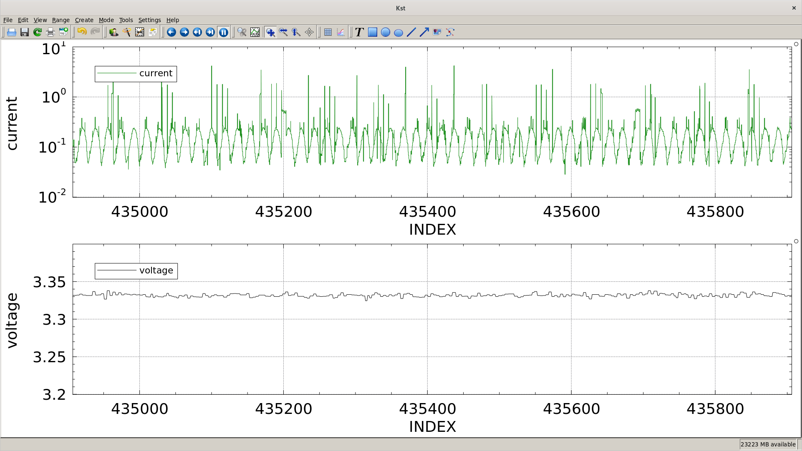

## AEM dumping via libjaylink

This is probably more useful.  You can do things like Simplicity Studio's
Energy profiler, by hooking this to, for instance, kst2...

```
./aem-dump -c -m1 | tee -a dump1.log;
kst2 # and then import the dump1.log and you can get live current/voltage monitoring...
```



libjaylink-devel is available for fedora at least, if not, get it from [libjaylink](https://gitlab.zapb.de/libjaylink/libjaylink)

## wireshark usb decoder for jlink traffic

it's not _remotely_ finished, but the stub is there to plug in a statemachine....
